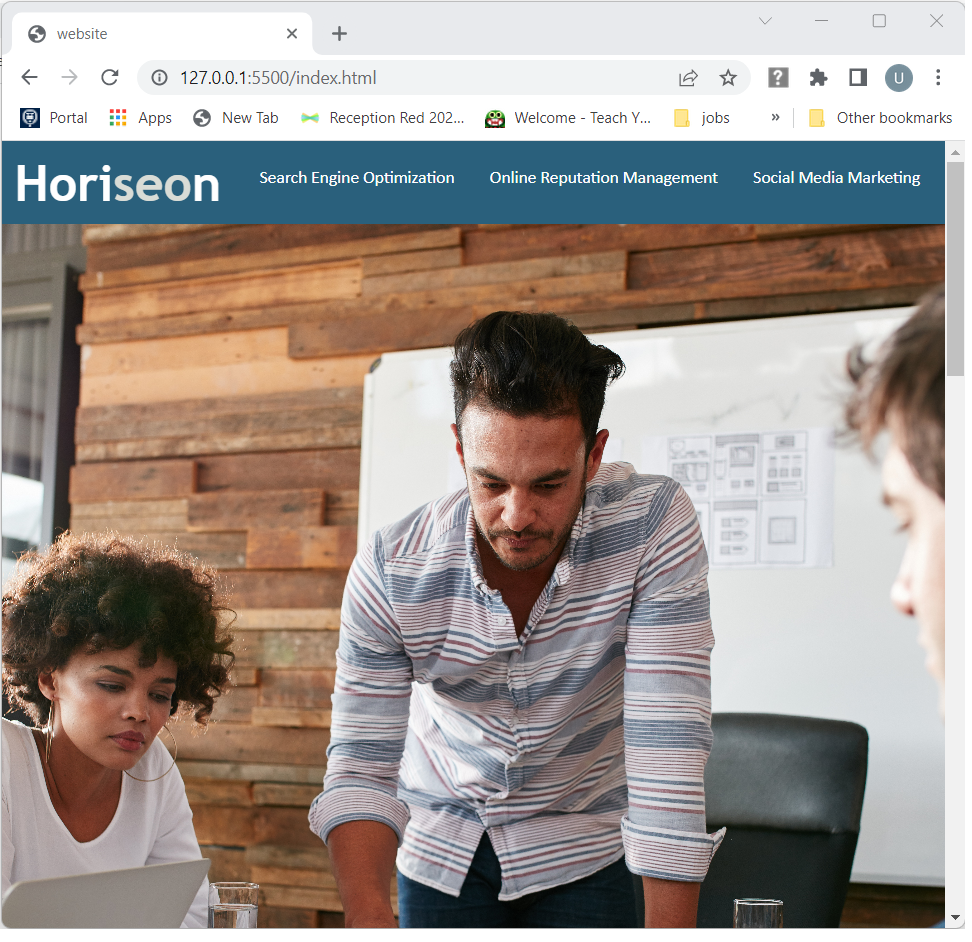
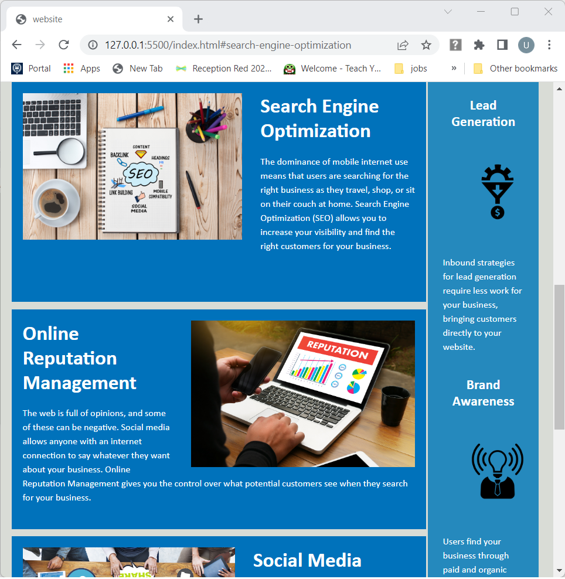
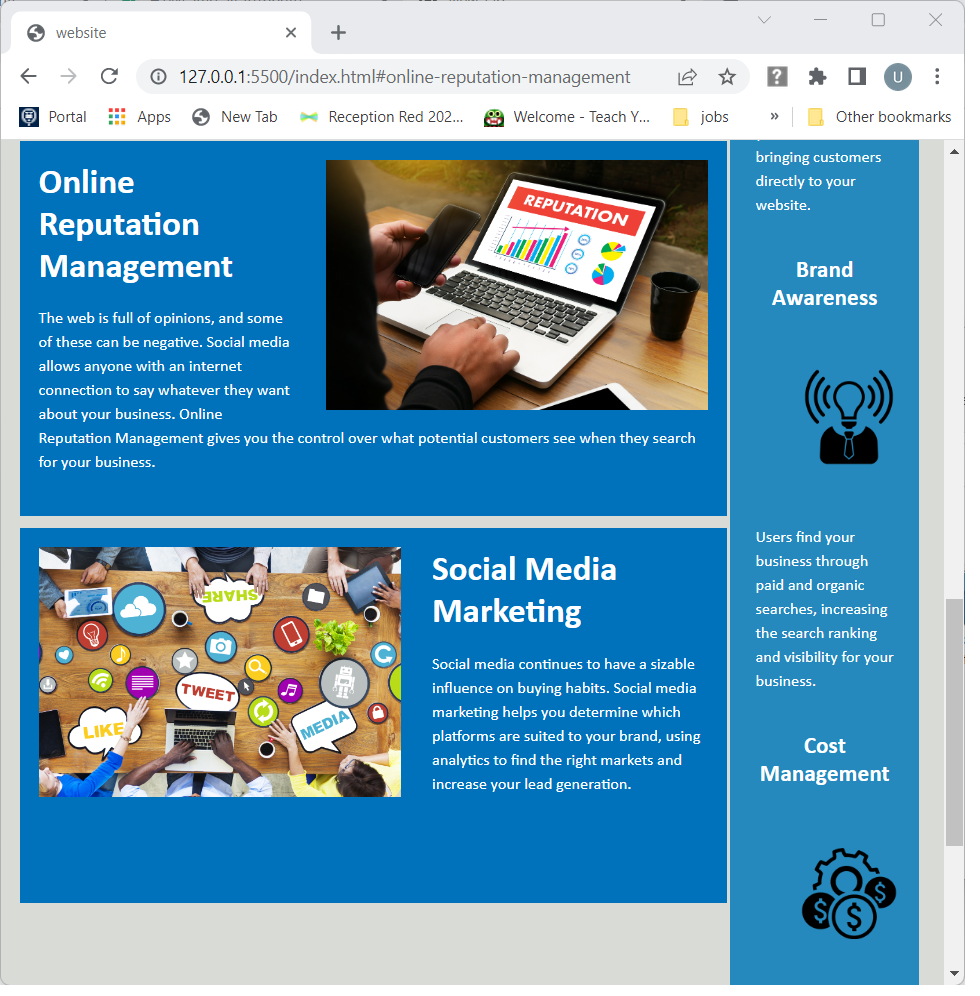
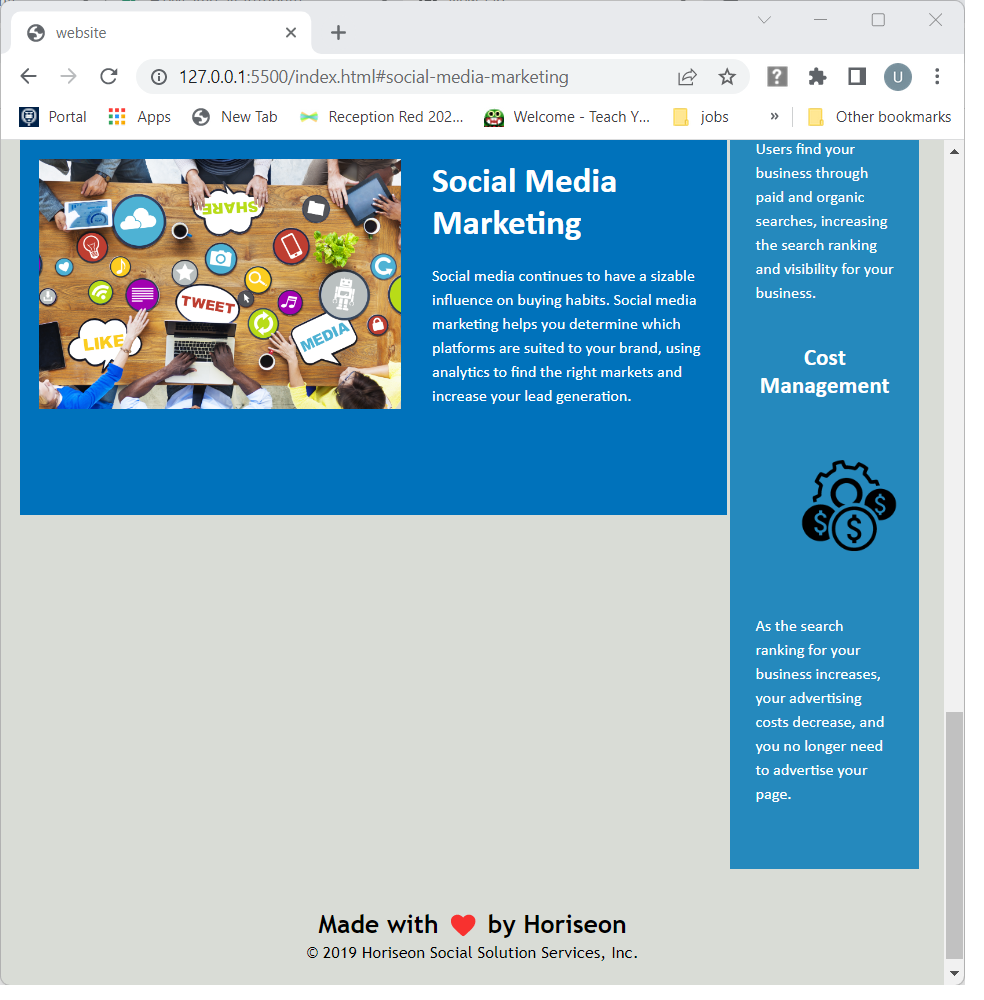

# 01 HTML CSS Git: Code Refactor

## Your Task
 
**Note**: Be sure to review the [Challenge Guide](./Challenge-Guide.md) and the [Good README Guide](./Good-README-Guide.md) before you start working on this assignment!

This week your challenge is an on-the-job ticket, which means you'll begin with starter code that you need to modify. This week's challenge involves a very important aspect of web development: **accessibility**. 
 
One of the most common tasks for front-end and junior developers is to take existing code and refactor it (recall that to refactor code is to improve it without changing what it does) to meet a certain set of standards or implement a new technology. In this challenge, a marketing agency has hired you to refactor an existing site to make it more accessible. 
 
Web accessibility is an increasingly important consideration for businesses. It ensures that people with disabilities can access a website using assistive technologies such as video captions, screen readers, and braille keyboards. Making a website accessible is also good for business for many reasons, one of them being that accessible sites are better positioned in search engines like Google. It also helps companies avoid litigation that can occur when people with disabilities cannot access their website.
 
Even though accessibility is a broad topic that can include complex requirements, your tech lead has given you a small list of specific criteria to satisfy the project. These criteria are documented below in the Acceptance Criteria.
 
**Important**: An important rule to follow when working with someone else's code is the **Scout Rule**, which recommends that you always leave the code a little cleaner than when you found it.

To impress clients, you should always go the extra mile and improve the codebase for long-term sustainability. For example, make sure that all links are functioning correctly. Also, rework the CSS to make it more efficient by consolidating CSS selectors and properties, organizing them to follow the semantic structure of the HTML elements, and including comments before each element or section of the page.

Are you ready to jump in? Here are this week's challenge requirements:

### User Story

```
AS A marketing agency
I WANT a codebase that follows accessibility standards
SO THAT our own site is optimized for search engines
```

### Acceptance Criteria

Your website must meet accessibility standards. You can achieve this completing the following:

* Semantic HTML elements can be found throughout the source code
* HTML elements follow a logical structure independent of styling and positioning
* Image and icon elements contain accessible `alt` attributes
* Heading attributes fall in sequential order
* Title elements contain a concise, descriptive title

### Resources:

* [Semantic HTML](https://www.w3schools.com/html/html5_semantic_elements.asp)
* [Image `alt` attributes](https://www.w3schools.com/tags/att_img_alt.asp)

### Mock-Up

The following image shows the web application's appearance and functionality:


> **Note**: This layout is designed for desktop viewing, so you may notice that some of the elements don't look like the mock-up at a resolution smaller than 768px. Eventually you'll learn how to make elements responsive so that your web application is optimized for any screen size.


### Deployment URL 

The deployed application can be accessed using below URL 

https://umaparu.github.io/HoriseonWebsiteOptimization/

### Screenshots

The home page of Horiseon website


Search Engine Optimization Link


Online Reputation Management


Social Media Marketing


---
© 2022 Trilogy Education Services, a 2U, Inc. brand. All Rights Reserved.
